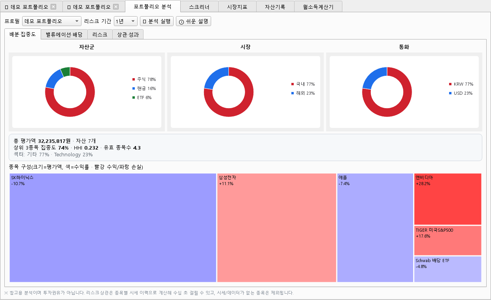

# 📊 주식 포트폴리오 매니저

**적금·주식·ETF·현금을 한곳에서 관리하고, 종목을 초보자 눈높이로 분석해 주는 Windows 데스크톱 앱**

종목 이름이나 코드만 넣으면 PER·PBR·ROE·배당 같은 지표를 자동으로 불러와 **신호등(저평가/적정/고평가)** 으로 알려주고, 포트폴리오 전체를 전문 분석기처럼 배분·리스크·상관관계까지 뜯어볼 수 있습니다. 한국·미국 종목과 주요 원자재를 지원합니다.


> ⚠️ **면책**: 무료 **지연 시세**를 사용하며, 모든 지표·분석은 **참고용**입니다. 투자 판단·매매 권유가 아니며, 투자의 책임은 본인에게 있습니다.

<!--
  📷 스크린샷 추가 권장(공개 어필에 효과적):
  1) 앱 실행 → 캡처(Win+Shift+S) → 저장
  2) 저장소에 docs/ 폴더 만들어 이미지 넣기
  3) 아래처럼 삽입:  
  포트폴리오 분석 탭, 종목 차트(지표), 시장지표 대시보드 3장 정도면 충분합니다.
-->

---

## ⬇️ 설치 (일반 사용자)

Python을 몰라도 됩니다. 설치파일만 받아 실행하세요.

1. **[Releases 페이지](https://github.com/sunhan1010-commits/stock-portfolio/releases/latest)** 에서 `StockPortfolio_Setup.exe` 다운로드
2. 실행 후 안내에 따라 설치 (관리자 권한 불필요, 사용자 폴더에 설치)
3. 바탕화면/시작메뉴의 **주식 포트폴리오 매니저** 아이콘으로 실행

> **"Windows의 PC 보호" 경고가 뜨나요?**
> 개인이 만든 무료 프로그램이라 코드 서명이 없어서 나타나는 정상적인 경고입니다.
> **추가 정보 → 실행** 을 누르면 설치됩니다. (백신이 잡으면 예외 등록해 주세요.)

### 🔄 자동 업데이트
앱을 켤 때 새 버전이 있으면 자동으로 안내합니다. 언제든 **＋프로필 ▾ → ⟳ 업데이트 확인** 으로 직접 확인할 수도 있습니다.

> 💾 보유내역·프로필 등 개인 데이터는 내 PC(`%LOCALAPPDATA%\StockPortfolioManager`)에만 저장됩니다. 어디로도 전송되지 않습니다.

---

## ✨ 주요 기능

### 📁 포트폴리오
- 주식·ETF·적금·예금·현금·기타 자산을 **프로필별로** 여러 개 관리 (프로필마다 탭)
- 실시간(지연) 시세로 평가금액·손익·**비중(%)** 자동 계산, 원/달러 등 **다중 통화** 환산
- **🛒 매수(추가 매입)**: 같은 종목을 사면 **평균단가·수량 자동 재계산** (물타기 반영)
- **💰 매도**: 실현손익 기록 → **📜 거래내역** 에서 누적 실현손익 확인
- **⚖️ 리밸런싱**: 목표 비중을 정하면 종목별 매수/매도 금액·수량 제안
- 나이·투자성향(공격/중립/보수) 기반 **권장 위험자산 비중** 안내
- 특정 자산을 계산에서 **제외**(보증금 등) 가능

### 📈 종목 실시간 · 분석
- `삼성전자` `005930` `AAPL` `애플` 처럼 입력하면 한국·미국 자동 판별 (한글 검색 지원)
- 준실시간 현재가 + **분봉/일봉 차트** (당일·1주·1개월·3개월·1년·5년·**전체**)
- **기술적 지표**(선택): 볼린저밴드·이동평균·일목균형표(오버레이) + RSI·MACD(보조창)
- **차트 확대/축소**: 마우스 휠 줌 · 드래그 구간확대 · 우클릭 이동 · **⤢ 크게 보기**
- PER·**추정 PER(Forward)**·PBR·ROE·배당·52주 위치를 **신호등**으로 평가 + ⓘ 지표 설명
- **📊 상세 데이터**: 목표주가·투자의견 컨센서스, 마진·성장률·재무안정성, 배당 성장률 등 확장 데이터셋
- 관심종목 저장(미보유 종목도), 차트 지점에 마우스를 올리면 데이터 팝업

### 🔬 포트폴리오 분석 *(전문 분석기 스타일)*
보유 포트폴리오를 4가지 관점으로 심층 분석합니다. **ⓘ 쉬운 설명** 버튼으로 모든 지표를 초보자용으로 풀이해 줍니다.
- **배분·집중도**: 자산군·시장·통화 도넛, 상위 집중도·HHI·유효 종목수, **트리맵**(크기=평가액, 색=수익률)
- **밸류에이션·배당**: 가중평균 PER/PBR/배당, 연간 예상 배당금, 종목별 손익 기여
- **리스크**: **표준편차(변동성) 기반 종합 위험도 등급**, 최대낙폭(MDD)·샤프지수·베타(코스피/S&P500)
- **상관·성과**: 종목 간 **상관관계 히트맵**(분산효과 확인), 포트폴리오 vs 지수 추이

### 🔎 스크리너
- 국내(시총상위·업종별)와 **미국 주요 대형주·ETF** 를 PER·PBR·ROE·배당·시총 조건으로 필터
- 더블클릭으로 바로 분석, 선택 종목을 관심종목으로 저장

### 🌐 시장지표
- 지수(코스피·코스닥·**S&P500·나스닥·다우**)와 **주요 원자재**(WTI·브렌트유·천연가스·금·은·구리·백금·팔라듐·곡물 등)
- **그리드 대시보드**(여러 종목 한눈에) + 단일 상세, **당일 분봉 실시간** 그래프

### 📒 자산기록 · 💵 월소득계산기
- 시점별 자산을 저장해 **규모·수익률·손익·자산군 비중** 추이를 분기·연도별로 비교
- 월 소득을 저축·생활비·투자 등으로 배분(비율↔금액 양방향), **프로필별 저장**

---

## 📐 지표 기준 (초보자용 단순 가이드)

| 지표 | 저평가/우수 | 적정 | 다소 높음 | 주의 |
|------|:-----:|:-----:|:-----:|:-----:|
| PER | < 10 | 10~20 | 20~35 | > 35 |
| PBR | < 1 | 1~2 | 2~4 | > 4 |
| ROE | ≥ 15% | 10~15% | 5~10% | < 5% |
| 배당수익률 | ≥ 4% | 2~4% | < 2% | 무배당 |

> 업종·성장성을 배제한 일반 가이드입니다. 성장주는 높은 PER이 정상일 수 있어요.

---

## 🗂 데이터 출처

| 구분 | 출처 | 비고 |
|------|------|------|
| 한국 종목/지수 | 네이버 금융 | 사실상 실시간(지연 0) |
| 미국 종목/지수/원자재 | yfinance (Yahoo) | 약 15분 지연 |
| 국내 시세/상장정보 | FinanceDataReader | 일봉·지수 이력 |
| 환율 | Yahoo | USD·JPY·EUR·CNY·GBP |

- 데이터 저장: 로컬 **SQLite** — 인터넷 없이도 보유내역 유지
- 원자재 **두바이유**는 무료 시세가 없어 국제 벤치마크 **브렌트유**로 대체합니다.

---

## 🛠 개발자용 (소스에서 실행)

```bash
git clone https://github.com/sunhan1010-commits/stock-portfolio.git
cd stock-portfolio
python -m venv .venv
.venv\Scripts\pip install -r requirements.txt
.venv\Scripts\python app.py
```

- 실행 스크립트: `run.bat`(콘솔) / `주식앱_실행.vbs`(무콘솔)
- 설치파일 빌드: `build_installer.ps1` (PyInstaller + Inno Setup)
- 릴리스: `release.ps1 -Version x.y.z -Notes "..."` (빌드→GitHub 릴리스→자동 업데이트)

**SSL 인증서 오류**(보안 프로그램의 HTTPS 검사 환경): `.venv\Scripts\python setup_certs.py` 로 인증서 번들 재생성.

### 기술 스택
`Python 3.12` · `PySide6`(Qt GUI/Charts) · `yfinance` · `FinanceDataReader` · `SQLite` · `PyInstaller` + `Inno Setup`

### 파일 구성
| 파일 | 역할 |
|------|------|
| `app.py` | GUI 전체 |
| `datasource.py` | 종목·지수·원자재 데이터 조회 |
| `metrics.py` | 지표 신호등 평가 기준 |
| `indicators.py` | 기술적 지표(볼밴·RSI·MACD·일목) 계산 |
| `analytics.py` | 포트폴리오 분석(HHI·변동성·샤프·베타·상관) 계산 |
| `db.py` | SQLite 저장 |
| `updater.py` / `version.py` | 자동 업데이트 |
| `certs.py` / `setup_certs.py` | SSL 인증서 처리 |

---

## ⚖️ 면책 조항

이 소프트웨어는 **개인 학습·참고용**으로 제공되며, 표시되는 모든 시세·지표·분석 결과의 정확성·완전성·적시성을 보장하지 않습니다. 무료 지연 시세를 사용하므로 실제와 다를 수 있습니다. 본 앱의 어떤 내용도 **투자 자문이나 매매 권유가 아니며**, 이를 근거로 한 투자 결정과 그 결과에 대한 책임은 전적으로 사용자 본인에게 있습니다.
